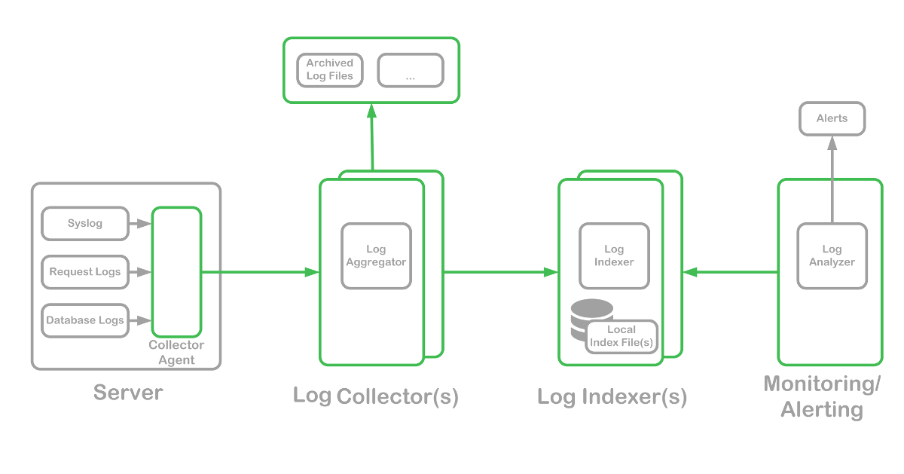

## Server logging for web apps


<!-- #### [Meetup XXX](https://www.meetup.com/XXX) -->
<!-- npm install; npm start -->

###### [TheodorosPloumis.com](http://www.theodorosploumis.com/en) / [@theoploumis](http://twitter.com/theoploumis)
________________________

###### Get them: [online presentation](http://theodorosploumis.github.io/logging-presentation) / [source code](https://github.com/theodorosploumis/logging-presentation)

###### Under [Attribution 4.0 International](http://creativecommons.org/licenses/by/4.0/) license. Icons by [icons8](https://icons8.com).

---

### What is this talk about

- What is logging
- How it works
- Why we need logging
- Common logging formats
- Logging examples
- Logging tools

---

### What is logging

A server log is a log file (or several files) automatically created and maintained by a server consisting of a list of activities it performed (eg a history of page requests).

[Source: wikipedia](https://en.wikipedia.org/wiki/Server_log)


---

### How it works



---

### Why we need logging
- Protect our app
- Know what is going on
- Know our visitors
- Plan our resources & needs
- Data is Data


---

### Log format templates

```
<1.address> <2.user> <3.datetime> <4.request> <5.http-status> \
<6.request-size> <7.referrer> <8.user-agent> <9.request-time>
```

---

### Log format variables

| variable | value |
|---|---|
| address | 62.109.16.162 |
| user | - |
| datetime | [26/Feb/2019:00:11:13 +0200] |
| request | "GET /index.php HTTP/1.1" |
| http-status | 200 |
| request-size | 20702 |
| referrer | "/user/login" |
| user-agent | "Mozilla/5.0 ... Safari/537.36" |
| request-time | 0.4 |


---

### Common log formats
```
// Common Log Format (CLF)
"%h %l %u %t \"%r\" %>s %b"

// Common Log Format with Virtual Host
"%v %h %l %u %t \"%r\" %>s %b"

// Extended/combined log format
"%h %l %u %t \"%r\" %>s %b \"%{Referer}i\" \"%{User-agent}i\""

// Referer log format
"%{Referer}i -> %U"

// Agent (Browser) log format
"%{User-agent}i"
```

See [apache log formats](https://httpd.apache.org/docs/2.4/mod/mod_log_config.html).

---

### Open source logging tools

- [rsyslog](https://www.rsyslog.com)
- [graylog](https://www.graylog.org)
- [logwatch](https://sourceforge.net/projects/logwatch)/[ELK stack](https://www.elastic.co/elk-stack)
- [logstash](https://github.com/elastic/logstash)
- [fluentd](https://www.fluentd.org)
- ... many non open-source tools


---

### Tips

- format in JSON
- use the common log-formats
- if you save logs use a nosql database
- log all application errors
- write messages in a human-readable form
- don't log informational data in production
- don't log insignificant events
- don't log anything a human can't read or react to

---

### Logging examples

- [Real logs](examples/access.log)

---

### Thank you!

Join [Serres Hackathon 2019](http://hackathon.serrestech.gr) May 2019

#### Questions?
